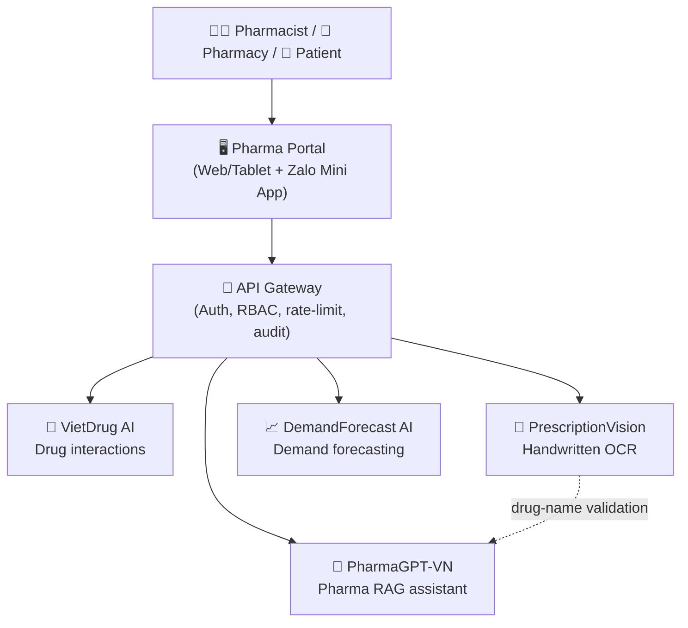

# 🏥 PharmLink AI

### An AI pharmacy platform for 60,000+ Vietnamese pharmacies

*Four specialized pharma AI engines + an operations Portal — end-to-end digitization of the pharmaceutical supply chain and pharmaceutical care for 100 million Vietnamese.*

---

## 🎯 The problems we solve

Vietnam's retail pharmacy sector faces several challenges at once:

- **Dangerous drug interactions** — tens of thousands of hospitalizations per year; pharmacists can't look them up manually in time.
- **Hard-to-read handwritten prescriptions** — "guessing" a doctor's handwriting is a leading cause of dispensing errors.
- **No Vietnamese-native clinical assistant** — foreign LLMs don't understand local brand drugs and send patient data to overseas clouds.
- **Wasteful inventory** — intuition-based ordering leaves 10–15% of stock expired (≈ 3,000–5,000 billion VND/year industry-wide).

**PharmLink AI** addresses all of these with four dedicated AI engines, unified inside a single operations platform for pharmacies.

---

## 🧩 Platform architecture

---

## 🚀 The AI engines

| Engine | Role | Core technology | Repo |
|--------|------|-----------------|------|
| 💊 **VietDrug AI** | Personalized drug-interaction alerts in < 200 ms | Knowledge Graph (Neo4j) + GNN (PyTorch Geometric) | [Pharma-VietDrugAI](https://github.com/AuLac-Grand-Prize/Pharma-VietDrugAI) |
| 📝 **PrescriptionVision** | Read Vietnamese handwritten prescriptions → FHIR | Qwen2.5-VL + YOLOv8 (5-stage pipeline) | [Pharma-PrescriptionVision](https://github.com/AuLac-Grand-Prize/Pharma-PrescriptionVision) |
| 🤖 **PharmaGPT-VN** | 24/7 pharmacist AI assistant with cited answers | RAG (Qdrant + BGE-M3) + 3-branch QU + CRAG | [PharmaGPT-VN](https://github.com/AuLac-Grand-Prize/PharmaGPT-VN) |
| 📈 **DemandForecast AI** | Demand forecasting & optimal reorder suggestions | Ensemble (Prophet/LGBM/TFT/N-HiTS) | [Pharma-DemandForecast](https://github.com/AuLac-Grand-Prize/Pharma-DemandForecast) |

### 🖥️ Platform layer

| Component | Description | Repo |
|-----------|-------------|------|
| **Pharma Portal** | POS + Clinical Assistant + Inventory + Patient Care + Compliance (Next.js, tablet-first, i18n vi/en) | [Pharma-Portal](https://github.com/AuLac-Grand-Prize/Pharma-Portal) |

---

## 📊 Target impact

| Metric | Target |
|--------|--------|
| 🎯 Recall on high-severity drug interactions | ≥ 95% |
| ✍️ Prescription OCR accuracy (common drugs) | ≥ 92% |
| 💬 Clinical answers with a cited source | 100% |
| 📦 Reduction in dead stock | −40% |
| ⏱️ Interaction-lookup latency | ≤ 200 ms |

---

## 🛠️ Tech stack

**AI/ML:** PyTorch · PyTorch Geometric · Transformers · Darts · Prophet · LightGBM
**Backend:** FastAPI · Neo4j · PostgreSQL/TimescaleDB · Qdrant · Redis · MLflow
**Frontend:** Next.js 14 · React 18 · TypeScript · TailwindCSS
**Infrastructure:** Docker · on-premise in Vietnam (compliant with Decree 13/2023 on personal data)

---

**PharmLink AI** — *Connecting data, making medication safe for every Vietnamese.* 🇻🇳

