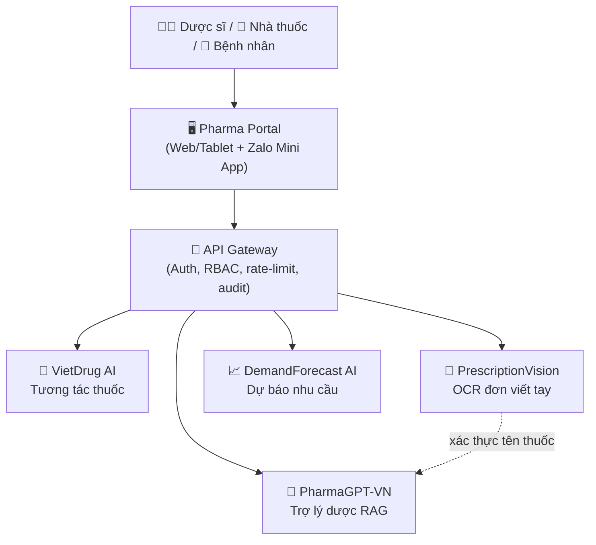

# 🏥 PharmLink AI

### Nền tảng AI dược phẩm cho 60.000+ nhà thuốc Việt Nam

*4 engine AI chuyên ngành dược + Portal vận hành nhà thuốc — số hóa toàn diện chuỗi cung ứng & chăm sóc dược cho 100 triệu người Việt.*

---

## 🎯 Vấn đề chúng tôi giải quyết

Ngành dược bán lẻ Việt Nam đang đối mặt nhiều bài toán cùng lúc:

- **Tương tác thuốc nguy hiểm** — hàng chục nghìn ca nhập viện/năm; dược sĩ không kịp tra cứu thủ công.
- **Đơn thuốc viết tay khó đọc** — "đoán chữ" bác sĩ là nguyên nhân hàng đầu gây sai sót cấp phát.
- **Thiếu trợ lý tra cứu tiếng Việt** — LLM nước ngoài không hiểu biệt dược VN, lại đưa dữ liệu bệnh nhân ra cloud ngoài.
- **Tồn kho lãng phí** — đặt hàng cảm tính → 10–15% thuốc hết hạn (3.000–5.000 tỷ VNĐ/năm toàn ngành).

**PharmLink AI** giải quyết trọn vẹn bằng 4 engine AI chuyên biệt, tích hợp trong một nền tảng vận hành duy nhất cho nhà thuốc.

---

## 🧩 Kiến trúc nền tảng

---

## 🚀 Các engine AI

| Engine | Vai trò | Công nghệ lõi | Repo |
|--------|---------|---------------|------|
| 💊 **VietDrug AI** | Cảnh báo tương tác thuốc cá nhân hóa < 200 ms | Knowledge Graph (Neo4j) + GNN (PyTorch Geometric) | [Pharma-VietDrugAI](https://github.com/AuLac-Grand-Prize/Pharma-VietDrugAI) |
| 📝 **PrescriptionVision** | Đọc đơn thuốc viết tay tiếng Việt → FHIR | Qwen2.5-VL + YOLOv8 (pipeline 5 giai đoạn) | [Pharma-PrescriptionVision](https://github.com/AuLac-Grand-Prize/Pharma-PrescriptionVision) |
| 🤖 **PharmaGPT-VN** | Trợ lý dược sĩ AI 24/7, trả lời có trích dẫn | RAG (Qdrant + BGE-M3) + 3-branch QU + CRAG | [PharmaGPT-VN](https://github.com/AuLac-Grand-Prize/PharmaGPT-VN) |
| 📈 **DemandForecast AI** | Dự báo nhu cầu, gợi ý đặt hàng tối ưu | Ensemble (Prophet/LGBM/TFT/N-HiTS) | [Pharma-DemandForecast](https://github.com/AuLac-Grand-Prize/Pharma-DemandForecast) |

### 🖥️ Lớp nền tảng

| Thành phần | Mô tả | Repo |
|-----------|-------|------|
| **Pharma Portal** | POS + Clinical Assistant + Inventory + Patient Care + Compliance (Next.js, tablet-first, i18n vi/en) | [Pharma-Portal](https://github.com/AuLac-Grand-Prize/Pharma-Portal) |

---

## 📊 Mục tiêu tác động

| Chỉ số | Mục tiêu |
|--------|----------|
| 🎯 Recall tương tác thuốc nguy hiểm | ≥ 95% |
| ✍️ Độ chính xác OCR đơn thuốc (top thuốc phổ biến) | ≥ 92% |
| 💬 Tỷ lệ câu trả lời lâm sàng có trích dẫn nguồn | 100% |
| 📦 Giảm tồn kho chết | −40% |
| ⏱️ Latency tra cứu tương tác | ≤ 200 ms |

---

## 🛠️ Tech stack

**AI/ML:** PyTorch · PyTorch Geometric · Transformers · Darts · Prophet · LightGBM
**Backend:** FastAPI · Neo4j · PostgreSQL/TimescaleDB · Qdrant · Redis · MLflow
**Frontend:** Next.js 14 · React 18 · TypeScript · TailwindCSS
**Hạ tầng:** Docker · vận hành on-premise tại Việt Nam (tuân thủ Nghị định 13/2023 về dữ liệu cá nhân)

---

**PharmLink AI** — *Kết nối dữ liệu, an toàn dùng thuốc cho mọi người Việt.* 🇻🇳

